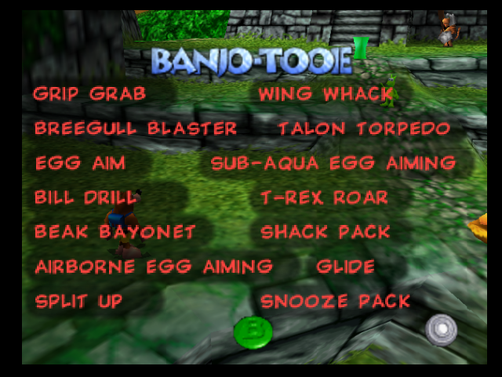
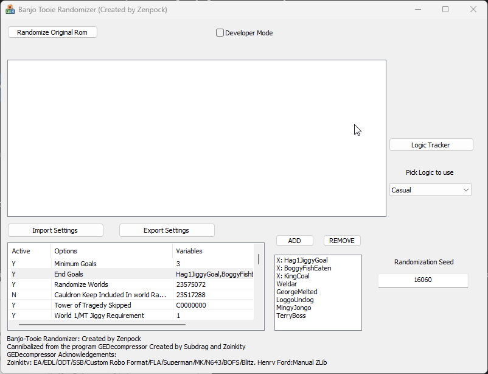

# Banjo Tooie Randomizer
This is a randomizer project build in C++ intended for use with the US version of Banjo Tooie

## How to play
  - Open the TooieRando.exe found in the TooieRando folder
  - Enter a randomization seed or leave blank to get the default seed
  - In the bottom left corner of the application you will find a scrollable list of options that you can modify.
  - To Start Randomizing Click "Randomize Original Rom"
  - Select your US Banjo Tooie rom
  - It may take a few minutes before the randomization is done
  - A prompt should open saying "Randomization Complete!" at which point you will be prompted to where to save your game.
  - From this point you can either load up the rom in your emulator of choice or put in a different seed if you don't like the original and click "Re-Randomize" then "Save Rom" once control is returned to you

### Discord
I've made a discord for the randomizer to help with troubleshooting issues or if you want to provide suggestions. https://discord.gg/H6xfyHk9Wm
## Features
### Gameplay Changes
#### Canary Mary 
- The Player speed cap in canary mary has been removed so you can win the race unshackled.
#### Level Opening
- Levels will open automatically once the player has received the required amount of jiggies, this can be turned off in the settings.
#### Warp Pads

- You can now swap characters at warppads!!
- While Standing on Warppads press the bumper buttons and you will switch between Mumbo Banjo and the Humba Wumba Transformations for that level.
- Warppads no longer provide an explanation when too far away they simply open the warp menu.

#### Pause Menu

  
  

- There is a new page of the pause menu made for the Randomizer
- Perish Button immediately kills the player for quick exits
- Return to Jinjo Village warps the player directly to Jinjo Village
- View Moves shows a list of the gathered moves for quick reference
- View totals was moved into the randomizer menu for space

#### Custom Goals
- Custom Goals restrict access to the final fight until they are completed.
- Custom Goals can be changed in the options/settings menu inside the randomizer application.
- A minimum number of Custom Goals can be set below the amount of goals available meaning you can complete 

#### Logic Tracker

  
  
- On the right side of the Randomizer Application you can find the button to open the logic tracker.
- After selecting which logic setting you want you can fill out all of the information you've gathered as you play the game to ensure nothing is forgotten.
- This also is a tool to show you how my logic charting works because it uses the exact same code as the randomizer itself.
#### Importing and Exporting Settings
You can now import and export your settings to and from a file with the click of a button so you don't have to navigate the menus to make the perfect game each time. 

### Some Information about how this randomizer works
  - Logic Files can be selected from a dropdown to determine what kind of tricks you want to be required to progress (By default there is only 1 logic file) 
  - Collectable Items have been randomized across the whole game by default (Jiggies, Glowbos Mega Included, Honeycombs, Cheato Pages, Boggy Fish, Tickets, Doubloons, and Jinjos are randomized)
  - Options for picking how certain objects are randomized are included to set the values for these options first ensure they are active and click on the option you would want to change now you can use the list of options that shows up to add and remove selections from the variables.
  - For all randomization options if you include an option in the No Randomization option this supercedes other randomization options so be aware of this.
  - The No Randomization option includes the Jade Totems by default you can change this by removing it in the editor or removing it from the RandomizerOptions file.
  - Move Givers can give any item that can normally be given as a reward in addition to Moves.
  - Moves that are placed in the world will appear as a spinning rareware logo.
  - All Silos can be used by any character so you do not need to be the correct character to learn a move.
  - Notes are randomized within their world so all notes that were in a level should still be somewhere within that level (unless I messed it up)
  - Reward Items can only be the following items (Jiggies, Glowbos, Honeycombs, Cheato Pages, Tickets, Doubloons, Jinjos, and Moves)
  - A Spoiler Log can be found in the folder with the application after the randomizer has finished it is in the SpoilerLog.txt file
### Known Issues
  - No Controller on the game loading this is due to the incorrect save-type being used in the emulator to fix the issue for Project64 go to Configuration -> Config: BANJO TOOIE then switch default save type to 16-kbit eeprom.
  - Logic Errors may occur I have attempted to provide popups when they occur but when this happens please try another seed.
  - Waiting long enough on the title screen will crash (I do not know what it is trying to do but just dont be there)
  - Some Items are not randomized due to difficulty in Randomizing them (Jade Snake, Dinosaur Family, Robot Fight GI Inside, Column Jiggy, Pawno, Warming the water)
  - Reward items may spawn in slightly different places than in the original game. This is due to the way jiggies are handled in the original code for rewards as opposed to everything else.
  - Glowbos may look weird they are technically heavily modified honeycombs but they should still work right
  - Silos that give you egg moves will not refill your eggs (The original locations of those move will though)
  - Minigames like canary mary will show vanilla items while in them
  - Multiplayer maps will crash your game (I removed them early in the project for space because I was scared to shift assets around DO NOT TRY TO GO TO THEM)
### Future Features
  - ~~Logic~~
  - ~~Moves Item (An Item that gives an associated move)~~
  - ~~More Options (Keeping Items in Level)~~
  - Stop and Swap (Randomizing the game paks is disabled so they will all be in their vanilla positions)

### Special Features
  Since this tool is a heavily modified version of a modding tool GEDecompressor this randomizer can also work as a more specialized Banjo Tooie mod tool.
Some of the features I've changed 
  - Double clicking any asset in the list will open the associated file in a text editor.
#### Asset Offset/Allocation Editor
  - Right clicking on any script or map asset in the asset window will allow you to edit the allocated size for the given script this must be done in intervals of 4 otherwise the asset will not be seen as valid.
  - Right click menu can also edit the offset table at the start of scripts
#### Logic Editor
  - By Clicking on the Logic Editor button after loading a Tooie Rom you can edit/create Logic Files.
  - Logic Groups work by progressing along dependent groups.
  - Logic Groups can be unlocked by fulfilling the requirements defined within. Each logic group can contain multiple possible routes for unlocking by using different Requirement Sets.
  - Logic Groups can contain keys which are only unlocked when the requirements for a given group are fulfilled making it possible to create simple dependencies for instances like switches or having access to a flight pad.
  - After completing a logic file it can be added to the file "LogicFiles.txt" where you define the name, starting group and path to the file.
